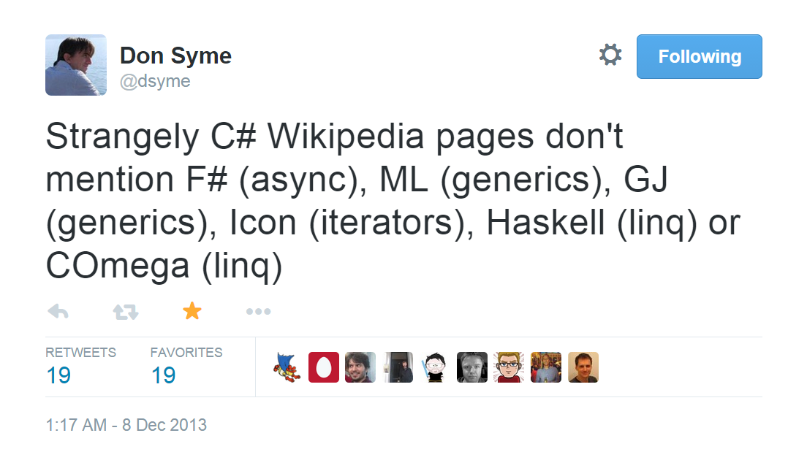
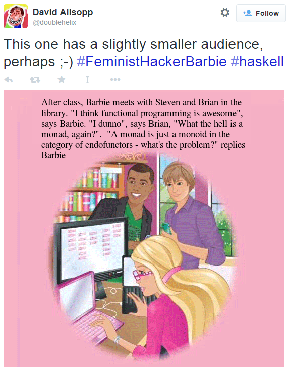
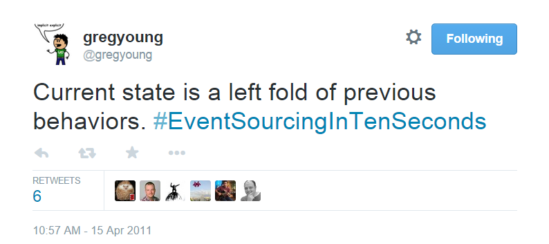

## Jak nauczyliśmy się programować funkcyjnie nic o tym nie wiedząc

- Twitter: [@orientman](https://twitter.com/orientman)
- GitHub: https://github.com/orient-man
- Blog: https://orientman.wordpress.com/

---

## Abstrakt

Elementy programowania funkcyjnego, na długo przed tym, zanim hipsterzy zaczęli zadawać się z monoidami i zapuszczać funktory, pojawiły się w języku C#. U licha! już ładnych kilka lat piszemy funkcyjnie, nic o tym nie wiedząc. Przyjrzymy się długoletniej pracy chochlików na usługach funkcyjnej policji myśli. Punktem startu będzie najczystszy możliwy kod obiektowy zrefaktorowany przez Wujka Boba, który… poprawimy, a może nawet przepiszemy.

---

## O mnie

- Tata^2, mąż humanistki, mól książkowy, uparciuch, programista, konferencjoholik.  Don Kichot walczący z entropią. Kocha sprzeczności i humor. Wierzy w przypadek. Piwny filozof. W nielicznych wolnych chwilach harata w gałę (na bramce).

- Basic, Turbo Pascal/C, Assembler, Clipper, MS Access, Visual Basic, Java-XML :), C++, C#, JavaScript, F#...  i ze wszystkiego miałem frajdę, ale nie za wszystkim tęsknię.

- Absolwent informatyki i matematyki na UW. Tech lead w firmie Piątka.

***

## Na początku było słowo (pisane)

<!-- .slide: data-background="./images/book.png" style="padding: 20px; display: block; background: rgba(0, 0, 0, 0.4);" -->

<!-- .element: class="fragment" -->


- Dobry prezent dla każdego nowego programisty w zespole
- Opublikowana na początku 2007r.
- Rozdział 14: refaktoring programu Args
- Port 1-1 z Javy do C#

***

## Args

Chyba każdy popełnił kiedyś parser argumentów:

```cs
// Example usage: Args.exe -l -p 4444 -d "C:\Windows\Temp"
private static void Main(string[] args)
{
    var schema = "l,p#,d*";
    var arg = new Args(schema, args);
    var logging = arg.GetBoolean('l');
    var port = arg.GetInt('p');
    var directory = arg.GetString('d');
    // ...
}
```

---

# DEMO

Note:

- dobre OOP, unit testy, top-down, krótkie metody, dobre nazwy, SRP, łatwo rozszerzalny
- Alt-Enter i do przodu!
- lambdy i factory method (na górę kod, który będzie rozszerzany)
- ``Get<T>`` zamiast GetDouble... (nadal nie podoba mi się object)
- 1 zamiast 5 "zmiennych" instancji
- "zmienna", a raczej wartość bo się nie zmienia
- pure functions
- marshaller też jest w zasadzie funkcją
- IEnumerator jedynym stanem

---

### Podsumowanie

- mniej stanu, mniej drapania się po głowie
- funkcje bez efektów ubocznych (wyjątek: ``IEnumerator``)
- o działaniu czystych funkcji można wnioskować z samej deklaracji
- LINQ, generics, lambdy, var...

<!-- .element: class="fragment" -->
Java '06 vs. C# '14 - bój był nierówny...

***

<!-- .slide: data-background="./images/features1.png" style="padding: 20px; display: block; background: rgba(0, 0, 0, 0.4);" -->
## Teza: C# z każdą wersją coraz bardziej przyjazny dla FP i to nie jest przypadek

Note:
- za chwilę: stronniczy przegląd zmian w języku C#

---

<!-- .slide: data-background="./images/features2.png" style="padding: 20px; display: block; background: rgba(0, 0, 0, 0.4);" -->

## C# 2 (2005)

- Generics
- Nullable types and ?? operator
- Generators aka iterators
- Anonymous delegates

---

<!-- .slide: data-background="./images/features3.png" style="padding: 20px; display: block; background: rgba(0, 0, 0, 0.4);" -->
## C# 3 (2007)

- LINQ
- Anonymous types
- Lambda expressions
- Local variable type inference (var)
- Object &amp; collection initializers
- Automatic properties
- ...

---

<!-- .slide: data-background="./images/features4.png" style="padding: 20px; display: block; background: rgba(0, 0, 0, 0.4);" -->
## C# 5.0 &amp; .NET 4.5 (2012)

- async / await
- ``IReadOnlyList<>``, ``IReadOnlyDictionary<>``...
- Microsoft.Bcl.Immutable

---

## C# 6.0 (2015)
<!-- .slide: data-background="./images/features5.png" style="padding: 20px; display: block; background: rgba(0, 0, 0, 0.4);" -->

- (?) Primary constructors
- Readonly auto properties
- Static type using statements
- Declaration expressions
- Exception filters
- (?) Pattern matching
- Monadic null checking aka null propagator
- Method &amp; property expressions
- (?) Constructor type parameter inference

Note:
 - skąd się to wzięło, kto nam tak język komplikuje?

***

## Unde malum?



---

> Don Syme is the designer and architect of the F# programming language [...] Earlier, created generics in the .NET Common Language Runtime, including the initial design of generics for the C# programming language [...]

http://en.wikipedia.org/wiki/Don_Syme

***

<!-- .slide: data-background="./images/fp-way-bg.jpg" -->

# C# 6

# Functional way is the right way

---

### Primary constructors / Readonly auto properties

F# dziś:
```fsharp
type Point(x, y) =
    member this.X = x
    member this.Y = y
```

C# 2015:
```csharp
public class Point(int x, int y)
{
    private int x, y;
}
```

```csharp
public class Point(int x, int y)
{
    public int X { get; } = x;
    public int Y { get; } = y;
}
```

---

### Static type using statements

F# dziś:
```fsharp
module Math =
    let Add x y = x + y

Math.Add 2 2
open Math
Add 2 2
```

C# 2015:
```csharp
public static class Math
{
    public static int Add(int x, int y) { return x + y; }
}

using Math;

Add(2, 2);
```

Note: czyli używajmy funkcji jak ludzie

---

###  Declaration expressions

F# dziś:
```fsharp
let success, x = Int32.TryParse("123")
// lub
match TryParse("123") with true, x -> ... | _ -> ...
```

C# 2015:
```csharp
if (int.TryParse("123", out int x)) ... else ...
```

---

### Exception filters

F# dziś:
```fsharp
type ErrorCode = | UnexpectedArgument | InvalidFormat
exception ArgsException of ErrorCode

try
    raise (ArgsException UnexpectedArgument)
with
  | ArgsException UnexpectedArgument -> printfn "Unexpected argument"
  | ArgsException _ -> printfn "Other parsing error"
```

C# 2015:
```csharp
try
{
    throw new ArgsException(ErrorCode.UnexpectedArgument);
}
catch (ArgsException e) if (e.ErrorCode == ErrorCode.UnexpectedArgument)
{
    // ...
}
```

---

### Pattern matching

F# dziś:
```fsharp
let selfAwareTroll n =
    match n with
    | 1 -> "one"
    | 2 -> "two"
    | (3 | 4) -> "some"
    | a -> sprintf "i can't count to %d" a
```

C# ? - to by było coś...

Draft Spec dla C#: https://onedrive.live.com/view.aspx?resid=4558A04E77D0CF5!5396&app=Word

Note:
- switch na dopingu
- przykłady w F# jeszcze się pojawią :)

---

### Monadic null checking aka null propagator

F# dziś:
```fsharp
let (>>=) x y = Option.bind y x // generalnie mało przydatne
```

C# 2015:
```csharp
var bestValue = points?.FirstOrDefault()?.X ?? -1;
```

---

### Method &amp; property expressions (lambdas as definitions)

F# dziś: ha, ha - wolne żarty

C# 2015:
```csharp
public Point Move(int dx, int dy) => new Point(X + dx, Y + dy);
public double Distance => Math.Sqrt((X * X) + (Y * Y));
```

---

### Constructor type parameter inference

F# dziś:
```fsharp
let tuple = (5, "y")
```

C# 2015:
```csharp
// zamiast new Tuple<int, string>(5, "y") / Tuple.Create(5, "y")
var tuple = new Tuple(5, "y");
```

***

# Jeśli C# jest już językiem funkcyjnym to...

---

<!-- .slide: data-background="./images/skull.png" style="top: -50px !important;" -->
## Gdzie te Monady?

> "Monady – byty duchowe; nie mają charakteru czasowego ani przestrzennego"

Note:
 - zapytajmy eksperta

---

<!-- .slide: style="top: -100px !important;" -->


---

### Tako rzecze źródło wszelkiej wiedzy

"Monada jest rodzajem <font color="#fa0">konstruktora abstrakcyjnego typu danych</font> [...] Monady pozwalają programiście <font color="#fa0">sprzęgać ze sobą kolejno wykonywane działania</font> i budować potoki danych, w których każda akcja jest materializacją wzorca <font color="#fa0">dekoratora z dodatkowymi regułami przetwarzającymi</font>.

Formalnie monadę tworzy się definiując dwie operacje – wiązanie (ang. <font color="#fa0">bind</font>) i powrót (ang. <font color="#fa0">return</font>) [...]"

http://pl.wikipedia.org/wiki/Monada_%28programowanie%29

---

<!-- .slide: data-transition="convex" -->


---

### Ostatnia szansa: przez przykład
```csharp
public static Task<T> ToTask<T>(this T value) // aka "unit" lub "return"
{
    return Task<T>.Factory.StartNew(() => value);
}

public static Task<B> Bind<A, B>(this Task<A> a, Func<A, Task<B>> func)
{
    return a.ContinueWith(prev => func(prev.Result)).Unwrap();
}

public static Task<C> SelectMany<A, B, C>(
    this Task<A> a, Func<A, Task<B>> func, Func<A, B, C> select)
{
    return a.Bind(
        aval => func(aval).Bind(bval => select(aval, bval).ToTask()));
}
```

---

### Co to robi?

```csharp
Func<Task<int>> compute3 = () => 3.ToTask();
Func<int, int, Task<int>> prod = (x, y) => (x * y).ToTask();
Func<int, int, Task<int>> add = (x, y) => (x + y).ToTask();

var r =
    from a in compute3()
    from b in prod(a, 2)
    from c in add(b, 4)
    select c.ToString();

r.Result.Should().Be("10");
```

---

### Co kompilator tłumaczy na:

```csharp
var r =
    compute3()
        .SelectMany(a => prod(a, 2), (a, b) => new { a, b })
        .SelectMany(ab => add(ab.b, 4), (ab, c) => c.ToString());
```

---

### Przykłady typów monadycznych w C# ###

- ``Nullable<T>``
- ``Func<T>``
- ``Lazy<T>``
- ``Task<T>``
- ``IEnumerable<T>``

---

### Ograniczenia Monad w C# ###

- LINQ jest zaprojektowany do zapytań (zaskoczenie :)
    - Brak instrukcji sterujących: if/then/else, pętli etc.
- Brak uniwersalnego wsparcia dla typu "monadycznego" na poziomie języka np.: _notacja do_ w Haskellu, _computational expressions_ w F#

<!-- .element: class="fragment" -->
Stąd każdy typ monadyczny, aby w pełni się nim cieszyć wymaga zmian w składni C#.

***

## Computational Expressions w F# ##

Workflow _async_ będący pierwowzorem dla składni _async/await_ w C#:

```fsharp
open System.IO
open System.Net

let downloadUrl(url : string) = async {
    let request = HttpWebRequest.Create(url)
    use! response = request.AsyncGetResponse()
    let stream = response.GetResponseStream()
    use reader = new StreamReader(stream)
    return! reader.AsyncReadToEnd()
}
```

---

...co kompiltor przetłumaczy na:
```fsharp
async.Delay(fun () ->
    let request = HttpWebRequest.Create(url)
    async.Bind(request.AsyncGetResponse(), fun response ->
        async.Using(response, fun response ->
            let stream = response.GetResponseStream()
            async.Using(new StreamReader(stream), fun reader ->
                reader.AsyncReadToEnd()))))
```

<!-- .element: class="fragment" -->


---

...gdzie ``async`` jest instancją klasy ``AsyncBuilder``:

```fsharp
type AsyncBuilder =
    class
        new AsyncBuilder : unit -> AsyncBuilder
        member this.Bind : Async<'T> * ('T -> Async<'U>) -> Async<'U>
        member this.Combine : Async<unit> * Async<'T> -> Async<'T>
        member this.Delay : (unit -> Async<'T>) -> Async<'T>
        member this.For : seq<'T> * ('T -> Async<unit>) -> Async<unit>
        member this.Return : 'T -> Async<'T>
        member this.ReturnFrom : Async<'T> -> Async<'T>
        member this.TryFinally : Async<'T> * (unit -> unit) -> Async<'T>
        member this.TryWith : Async<'T> * (exn -> Async<'T>) -> Async<'T>
        member this.Using : 'T * ('T -> Async<'U>) -> Async<'U>
        member this.While : (unit -> bool) * Async<unit> -> Async<unit>
        member this.Zero : unit -> Async<unit>
    end
```

<!-- .element: class="fragment" -->
Na szczęście, aby używać LINQ-a nie musimy znać w każdym szczególe implementacji _LINQ Providera_ - to samo dotyczy _async_ i innych workflowów w F#.

***

### No dobrze, ale co to właściwie jest programowanie funkcyjne?

Rychło w czas...

Note:
- albo czym się jakościowo różni FP od OOP

---

### Przykład

<!-- .element: class="fragment" -->


<!-- .element: class="fragment" -->
DEMO z małym twistem, czyli "right fold" w F#

Note:

- bądźmy maksymalistami
- Playground.fs
- ciegiełkami są funkcje
- ważne są typy
- automatyczna generalizacja

***

### DEMO: Args w F# ###

Note:
- git checkout bang

***

<!-- .slide: data-background="./images/fp_contra_oop.jpg" -->

Note:
- co się spotkało z szybką ripostą Wujka Boba (bibliografia)
- skojarzenie lego Piraci vs. Technics

---

<!-- .slide: data-background="./images/fp_contra_oop.jpg" style="display: block; background: rgba(0, 0, 0, 0.4);" -->

## Podsumowanie

C# | F#
--- | ---
wyjątki | funkcje dwutorowe (monada ROP)
pętle | funkcje rekurencyjne
zmienne | parametry funkcji (akumulator)
składnia *fluent* | częściowa aplikacja argumentów
if/then/else/switch| pattern matching
...

Note:
- co się spotkało z szybką ripostą Wujka Boba (bibliografia)
- F# bez części kompatybilnej z C# byłby małym językiem
- skojarzenie lego Piraci vs. Technics
- ponad różnicami składnowymi, które są oczywiście ważne...

---

## Intuicje

 - ewolucja od monolitu do niezależnych jednostek; najpierw obiektów, potem funkcji
 - małe jednostki łatwiej zrozumieć, są elastyczne i dają szybką pętlę zwrotną (REPL, testy)
 - system typów może być pomocą a nie zawalidrogą (static vs. dynamic typing? static + type inference!)
 - nie musimy wszytkiego pisać funkcyjnie, ważne co widać z zewnątrz

Note:

 - FP jest trudne, może boleć głowa ;)

***

<!-- .slide: data-background="./images/forcsharp1.png" style="top: 300px !important;" -->
## Na koniec

<!-- .element: class="fragment" -->
Co wybrać?

---

<!-- .slide: data-background="./images/forcsharp2.png" data-transition="convex" -->
# F#?

---

<!-- .slide: data-background="./images/forcsharp3.png" data-transition="convex" -->
# C#?

---

<!-- .slide: data-background="./images/forcsharp4.png" data-transition="convex" -->
## Polyglot Programming!

***

## Bibliografia

- Blog: [F# for fun and profit](http://fsharpforfunandprofit.com/) - skarbiec!
- Artykuł: [Why Functional Programming Matters](http://www.cse.chalmers.se/~rjmh/Papers/whyfp.html)
- Książka: [Real-World Functional Programming: With Examples in F# and C# - Petricek & Skeet](http://www.amazon.com/Real-World-Functional-Programming-With-Examples/dp/1933988924)

Materiały:

- Slajdy: http://bstoknet46.orientman.com/
- Źródłowce: https://github.com/orient-man/CleanArgs

---


---

### Bibligrafia (horyzonty)

- [Don Syme - .NET/C# Generics History](http://blogs.msdn.com/b/dsyme/archive/2011/03/15/net-c-generics-history-some-photos-from-feb-1999.aspx)
- [Jared Parsons - Experiences using F# in VsVim](http://blog.paranoidcoding.com/2014/10/31/experiences-using-fsharp-in-vsvim.html)
- [John Carmack - In-depth: Functional programming in C++](http://gamasutra.com/view/news/169296/Indepth_Functional_programming_in_C.php)
- [Robert C. Martin (Uncle Bob) - OO vs FP](http://blog.cleancoder.com/uncle-bob/2014/11/24/FPvsOO.html)

---

### Bibliografia (Monady)

- Video: [Mike Hadlow on Monads](http://vimeo.com/21705972) - prościej się nie da?
- Video: [Scott Wlaschin - Railway Oriented Programming -- error handling in functional languages](http://vimeo.com/97344498)
- Video: [Greg Meredith - Monadic Design Patterns for the Web - Introduction to Monads](http://channel9.msdn.com/Series/C9-Lectures-Greg-Meredith-Monadic-Design-Patterns-for-the-Web/C9-Lectures-Greg-Meredith-Monadic-Design-Patterns-for-the-Web-Introduction-to-Monads) - abstrakcyjnie, ale zjadliwie
- Blog: [Fabulous adventures in coding: Monads, parts 1-13](http://ericlippert.com/category/monads/) - wyczerpująco

***

# Aaa... pytania?
